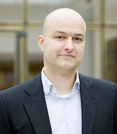

# Christof Lechner

<a href="mailto:cl108@protonmail.com">cl108@protonmail.com</a> | +49-176-87595322
| Immenstadt 

***
      

geboren am 12.04.1979 in Konstanz

***

## Aktuell

**Project Management, Test Managagement & 2nd Level Support @ Ceratizit Deutschland GmbH**

## Berufliche Laufbahn

`12.2014 - heute`
__Ceratizit Deutschland GmbH__
- *Digitale Applikationen*
- \#Anforderungen \#Testing \#2nd Level Support

`05.2012 - 04.2014`
__Voith Industrial Services GmbH & Co. KG (Stuttgart)__
- *Social Network Experte (\#Enterprise 2.0)*
- \#Anforderungsmanagement \#Weiterentwicklung \#Schulungen

`08.2008 - 12.2011`
__MFG Innovationsagentur für IT und Medien (Stuttgart)__
- *Projektleiter*
- \#Onlinemarketing \#Website Admin/Redaktion (CMS)

`02.2007 - 07.2008`
__MFG Innovationsagentur für IT und Medien (Stuttgart)__
- *Trainee*

`09.2006 - 01.2007`
__Trainer für Webentwicklung (Stuttgart)__
- *Trainer für \#Webentwicklung*

`01.2002 - 09.2002`
__Pflegeheim Talgarten (Konstanz)__
- *Pflegehelfer*

`10.1999 - 12.2001`
__Human Touch Media / SWR (Konstanz)__
- *Praktikant & Auszubildender*
- \#Mediengestalter Bild & Ton (unvollendet)

`09.1998 - 07.1999`
__Klinikum Konstanz__
- *Zivildienstleistender*

## Akademische Laufbahn

`10.2002 - 08.2006`
__Hochschule der Medien Stuttgart__
- *Diplom-Informationswirt (FH)*
- \#Informationswirtschaft \#IT \#BWL 

## Fachkenntnisse / Skills

__Webskills:__
- SCRUM \. Agiles Projektmanagement
- HTML \. CSS
- PHP \. SQL \. XML \. Javascript

__Applikationen (Anwenderkenntnisse):__
- SAP BO \. ERP
- Typo3 \. Wordpress \. AEM
- E-Commerce Systeme (SAP Hybris)
- JIRA Software (JSM, etc.)

__Sprachen:__
- Deutsch (Muttersprache)
- Englisch (Fließend in Wort & Schrift)
- Niederländisch (Muttersprache)
- Russisch (Gut)

__Interessen:__
- Meditation
- Fitness

***

`01.2012 - 04.2012`
- *Arbeitssuchend nach Auslaufen*  
- *des befristeten Arbeitsverhältnisses*

`05.2014 - 11.2014`
- *Arbeitssuchend nach Auslaufen*  
- *des befristeten Arbeitsverhältnisses*
- *Mehrstufiger Bewerbungsprozess & Umzug ins Allgäu*

***
Letztes Update: Juli 2022
